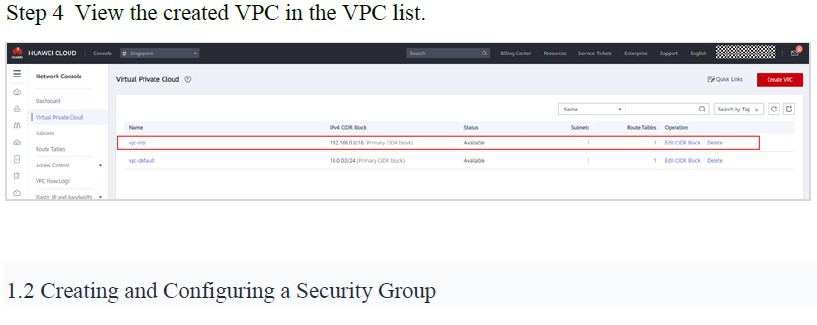
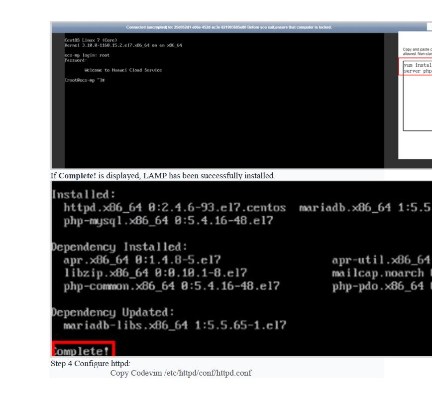

# LAB 1: Deploying an Enterprise Web

An enterprise intends to deploy their website on HUAWEI CLOUD and they have the following requirements:

1.Database nodes and service nodes are deployed on separate ECSs.

2.ECSs are added or removed as incoming traffic changes over time.

**Prerequisites:** Log in to HUAWEI CLOUD.Go to the [Lab Desktop] and open the Google Chrome browser to access the HUAWEI CLOUD login page. Select IAM User Login. In the login dialog box, enter the assigned HUAWEI CLOUD lab account and password to log in to HUAWEI CLOUD, as shown in the following figure.

Note: For details about the account information, see the upper part of the lab manual. Do not use your HUAWEI CLOUD account to log in.

**1.Tasks**

1.1 **Creating a VPC**

**Step 1** Switch to the management console, and select the AP-Singapore region. In the left navigation pane, choose Service List > Networking > Virtual Private Cloud.

